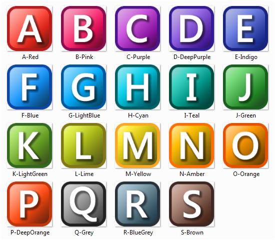

# Autohotkey-Icons
A collection of icons in the style of AutoHotkey's default icon, in a variety of colours.

## Preview

## Details

Characters included: A-Z, 0-9

Colours included: [Google's Material Design Colours](https://www.materialui.co/colors)

Templates included: Photoshop file and blank PNG files
