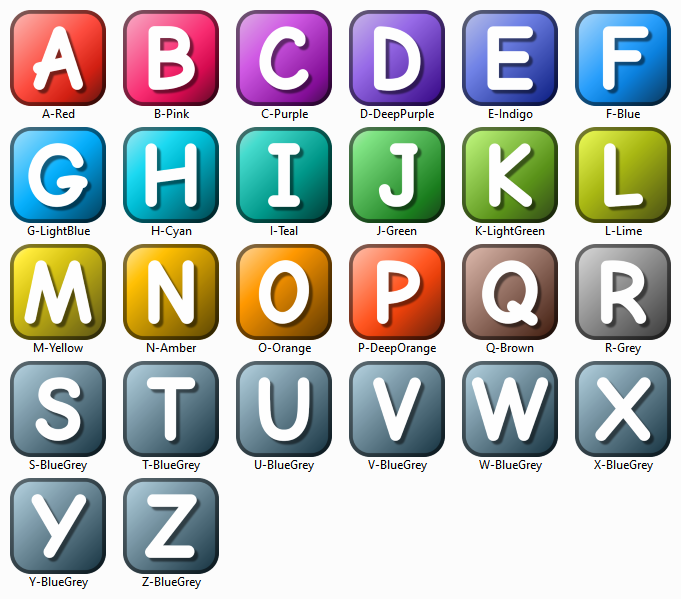

# Autohotkey-Icons
A collection of icons in the style of AutoHotkey's default icon, in a variety of colours.

[Available to download from the releases tab.](https://github.com/bluesatin/Autohotkey-Icons/releases)

## Previews
| v2 – [Release Link](https://github.com/bluesatin/Autohotkey-Icons/releases/tag/v2.0)  |
|----|
|   |

## Details
Characters included: A-Z, 0-9

Colours included: [Google's Material Design Colours](https://www.materialui.co/colors)

Templates included: SVG templates, and blank PNG files

## Old Versions
| v1 – [Release Link](https://github.com/bluesatin/Autohotkey-Icons/releases/tag/v1.0)  |
|----|
|   |
